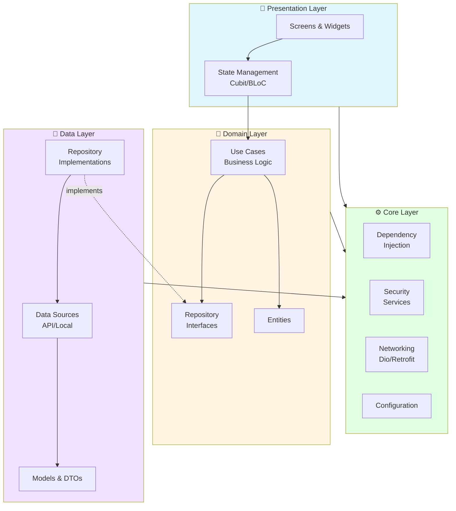
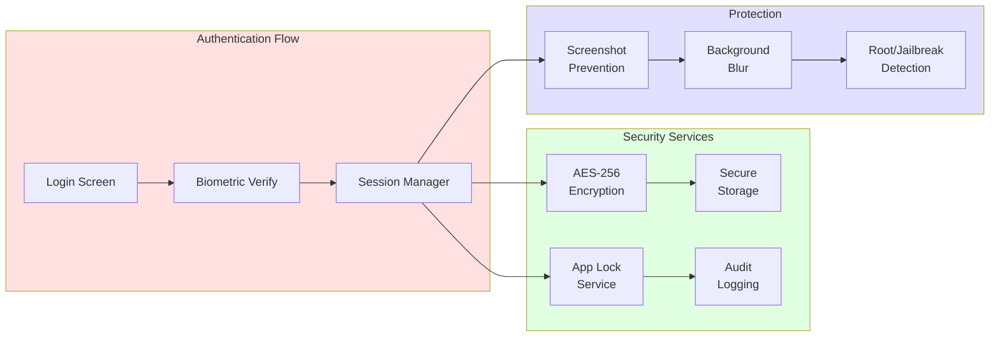

<div align="center">

# 🏦 CryptoWallet - Enterprise Fintech App

### Professional Flutter Cryptocurrency Trading Platform

[](https://flutter.dev)
[](https://dart.dev)
[](./docs/TESTING_GUIDE.md)
[](./LICENSE)
[](https://flutter.dev)

[Features](#-features) • [Demos](#-live-demos) • [Architecture](#-architecture) • [Getting Started](#-getting-started) • [Documentation](#-documentation)

</div>

---

## 🌟 Overview

**CryptoWallet** is an enterprise-grade cryptocurrency trading platform built with Flutter, showcasing professional software engineering practices including Clean Architecture, comprehensive security measures, and production-ready code quality.

### 🎯 Key Highlights

- 🏗️ **Clean Architecture** - Strict separation of concerns with domain-driven design
- 🔐 **Enterprise Security** - Biometric auth, AES-256 encryption, secure storage
- 📊 **Real-time Market Data** - Live cryptocurrency prices via CoinGecko API
- 💼 **Portfolio Management** - Track holdings with visual analytics
- 🧪 **Comprehensive Testing** - 122+ test cases with extensive coverage
- 🎨 **Modern UI/UX** - Material 3 design with light/dark theme support

---

## 📱 Live Demos

<div align="center">

### iOS Demo


### Android Demo


*Real device demos showcasing smooth animations, biometric authentication, and real-time market data*

</div>

---

## ✨ Features

### 🔐 Security & Authentication

- **Biometric Login** - Face ID / Touch ID / Fingerprint authentication
- **Email/Password Auth** - Firebase-powered authentication
- **Session Management** - Auto-expiring sessions with activity tracking
- **App Lock** - Auto-lock on inactivity with customizable timeout
- **Secure Storage** - AES-256 encryption for sensitive data
- **Screenshot Protection** - Prevents screenshots on sensitive screens
- **Background Blur** - Automatic privacy protection when app backgrounded
- **Root/Jailbreak Detection** - Security warnings on compromised devices
- **Audit Logging** - Complete security event tracking

### 📈 Market Features

- **Live Market Overview** - Real-time global crypto market statistics
- **Trending Coins** - Discover popular cryptocurrencies
- **Top Gainers** - Track best performing assets
- **Price Charts** - Historical price data visualization
- **Search & Filter** - Find coins by name, symbol, or category
- **Detailed Coin Info** - Market cap, volume, price changes

### 💰 Portfolio Management

- **Holdings Tracker** - Monitor your crypto investments
- **Portfolio Analytics** - Visual breakdown with pie charts
- **Performance Metrics** - Total value, gains/losses, percentages
- **Transaction History** - Encrypted transaction logs
- **Multi-timeframe View** - Daily, weekly, monthly analysis

### 🎨 User Experience

- **Onboarding Flow** - Smooth first-time user experience
- **Theme System** - Beautiful light/dark mode support
- **Responsive Design** - Optimized for phones and tablets
- **Intuitive Navigation** - Bottom navigation with smooth transitions
- **Error Handling** - User-friendly error messages and recovery
- **Pull-to-Refresh** - Easy data updates across all screens
- **Localization** - Multi-language support (Arabic/English)

---

## 🏗️ Architecture

### Clean Architecture Implementation



### Layer Breakdown

```
┌─────────────────────────────────────────────────────────┐
│                   Presentation Layer                     │
│  (UI, Screens, Widgets, Cubits/BLoC, Navigation)       │
└────────────────────┬────────────────────────────────────┘
                     │
┌────────────────────▼────────────────────────────────────┐
│                    Domain Layer                          │
│   (Business Logic, Use Cases, Entities, Repositories)   │
└────────────────────┬────────────────────────────────────┘
                     │
┌────────────────────▼────────────────────────────────────┐
│                     Data Layer                           │
│     (APIs, Models, Repository Implementations)          │
└────────────────────┬────────────────────────────────────┘
                     │
┌────────────────────▼────────────────────────────────────┐
│                     Core Layer                           │
│  (DI, Security, Networking, Config, Common Utilities)   │
└─────────────────────────────────────────────────────────┘
```

### Security Architecture



### Project Structure

```
lib/
├── core/                      # Core infrastructure
│   ├── config/               # App configuration
│   ├── constants/            # Constants and strings
│   ├── di/                   # Dependency injection (GetIt)
│   ├── networking/           # HTTP client, API services
│   ├── routing/              # Navigation (GoRouter)
│   ├── security/             # Security services
│   │   ├── interfaces/      # Security contracts
│   │   └── implementations/ # Security implementations
│   └── common_ui/           # Shared widgets
│
├── features/                 # Feature modules (Clean Architecture)
│   ├── auth/                # Authentication & biometrics
│   │   ├── data/           # Data sources, models, repos
│   │   ├── domain/         # Entities, use cases, contracts
│   │   └── presentation/   # Screens, widgets, cubits
│   ├── home/               # Dashboard & market overview
│   ├── market/             # Crypto market & trading
│   ├── portfolio/          # Portfolio management
│   ├── transactions/       # Transaction history
│   ├── profile/            # User profile
│   ├── settings/           # App settings
│   ├── onboarding/         # User onboarding
│   └── splash/             # Splash screen
│
└── main.dart               # App entry point

docs/                        # Comprehensive documentation
test/                        # Unit & widget tests
integration_test/           # End-to-end tests
```

---

## 🚀 Getting Started

### Prerequisites

- **Flutter SDK**: 3.0.0 or higher
- **Dart SDK**: 3.0.0 or higher
- **IDE**: VS Code, Android Studio, or IntelliJ IDEA
- **Firebase Account**: For authentication services
- **CoinGecko API Key**: (Optional) For enhanced API access

### Installation

1. **Clone the repository**

```bash
git clone https://github.com/yourusername/team_18_final_project.git
cd team_18_final_project
```

2. **Install dependencies**

```bash
flutter pub get
```

3. **Configure Firebase**
   - Create a Firebase project at [Firebase Console](https://console.firebase.google.com)
   - Download `google-services.json` (Android) → place in `android/app/`
   - Download `GoogleService-Info.plist` (iOS) → place in `ios/Runner/`
   - Enable Firebase Authentication and Firestore

4. **Configure API (Optional)**

```bash
# Get your API key from https://www.coingecko.com/en/api
# Run with API key:
flutter run --dart-define=COINGECKO_API_KEY=your_api_key_here
```

5. **Run the app**

```bash
# Development
flutter run

# Production
flutter run --release
```

### Running Tests

```bash
# Run all tests
flutter test

# Run with coverage
flutter test --coverage

# Run integration tests
flutter test integration_test

# Generate coverage report
genhtml coverage/lcov.info -o coverage/html
open coverage/html/index.html
```

---

## 🔧 Tech Stack

### Core Technologies

| Category | Technology | Purpose |
|----------|-----------|---------|
| **Framework** | Flutter 3.0+ | Cross-platform UI framework |
| **Language** | Dart 3.0+ | Programming language |
| **State Management** | Cubit (BLoC) | Predictable state management |
| **Dependency Injection** | GetIt | Service locator pattern |
| **Navigation** | GoRouter | Declarative routing |
| **Networking** | Dio + Retrofit | HTTP client & REST API |
| **Backend** | Firebase | Auth, Firestore, Storage |
| **Local Storage** | flutter_secure_storage | Encrypted local storage |
| **Encryption** | encrypt (AES-256) | Data encryption at rest |

### Key Packages

```yaml
dependencies:
  # State Management
  flutter_bloc: ^8.1.0

  # Dependency Injection
  get_it: ^7.6.0

  # Networking
  dio: ^5.3.0
  retrofit: ^4.0.0

  # Security
  flutter_secure_storage: ^9.0.0
  local_auth: ^2.1.0
  encrypt: ^5.0.0
  secure_application: ^3.7.1

  # Navigation
  go_router: ^13.0.0

  # UI
  flutter_screenutil: ^5.9.0

  # Backend
  firebase_auth: ^4.15.0
  cloud_firestore: ^4.13.0
```

---

## 📚 Documentation

### 📖 Complete Documentation Available

| Document | Description |
|----------|-------------|
| [Architecture Guide](docs/ARCHITECTURE.md) | Clean Architecture implementation with diagrams |
| [Core Architecture](docs/CORE_ARCHITECTURE_GUIDE.md) | Core layer services and utilities |
| [Security Features](docs/SECURITY_FEATURES_OVERVIEW.md) | Enterprise security stack |
| [Authentication Flow](docs/AUTH_FLOW.md) | Auth & biometric system |
| [Features Guide](docs/FEATURES_COMPLETE_GUIDE.md) | All features documentation |
| [Testing Guide](docs/TESTING.md) | Complete testing strategy, structure & philosophy |
| [API Integration](docs/API_INTEGRATION.md) | CoinGecko API usage |
| [Code Quality](docs/CODE_QUALITY_IMPROVEMENTS.md) | Clean code practices |
| [Module Docs](docs/FEATURE_DOCUMENTS/) | Per-module documentation |
| [Documentation Index](docs/DOCUMENTATION_INDEX.md) | Complete documentation navigation guide |

### Quick Links

- 🏗️ **New to the project?** → Start with [Architecture Guide](docs/ARCHITECTURE.md)
- 🔐 **Working on security?** → Read [Security Features](docs/SECURITY_FEATURES_OVERVIEW.md)
- 🧪 **Writing tests?** → Check [Testing Guide](docs/TESTING.md)
- 🎨 **Adding features?** → Follow [Features Guide](docs/FEATURES_COMPLETE_GUIDE.md)

---

## 🛡️ Security Features

This application implements **defense-in-depth security**:

### Layer 1: Authentication

- ✅ Firebase Authentication
- ✅ Biometric login (Face ID/Touch ID/Fingerprint)
- ✅ Email/password with validation
- ✅ Secure session management

### Layer 2: Data Protection

- ✅ AES-256-GCM encryption
- ✅ Platform secure storage (Keychain/Keystore)
- ✅ Encrypted transaction history
- ✅ Secure credential storage

### Layer 3: Application Security

- ✅ Auto-lock on inactivity
- ✅ Session timeout (configurable)
- ✅ Screenshot prevention on sensitive screens
- ✅ Background blur for privacy
- ✅ Root/jailbreak detection
- ✅ Audit logging for security events

**→ [Complete Security Documentation](docs/SECURITY_FEATURES_OVERVIEW.md)**

---

## 🌍 Supported Platforms

| Platform | Status | Min Version |
|----------|--------|-------------|
| 📱 iOS | ✅ Supported | iOS 12.0+ |
| 🤖 Android | ✅ Supported | Android 5.0+ (API 21) |
| 🌐 Web | ⚠️ Beta | Modern browsers |
| 💻 macOS | 📋 Planned | macOS 10.14+ |
| 🪟 Windows | 📋 Planned | Windows 10+ |

---

## 📊 Project Statistics

```
📁 Project Size:        302 Dart files
🧪 Test Coverage:       122+ passing tests
🔐 Security Features:   8 major security layers
📱 Screens:             20+ unique screens
🎨 Custom Widgets:      50+ reusable components
📚 Documentation:       10+ comprehensive docs
⚡ API Integration:     CoinGecko REST API
🏗️ Architecture:        Clean Architecture (strict)
🌍 Languages:           English, Arabic
```

---

## 🤝 Contributing

We welcome contributions! Please follow these guidelines:

### Development Workflow

1. **Fork the repository**
2. **Create a feature branch**

   ```bash
   git checkout -b feature/amazing-feature
   ```

3. **Make your changes**
   - Follow Clean Architecture principles
   - Write tests for new features
   - Update documentation
4. **Run quality checks**

   ```bash
   flutter analyze
   flutter format .
   flutter test
   ```

5. **Commit your changes**

   ```bash
   git commit -m "feat: add amazing feature"
   ```

6. **Push to your fork**

   ```bash
   git push origin feature/amazing-feature
   ```

7. **Open a Pull Request**

### Code Style

- ✅ Follow [Effective Dart](https://dart.dev/guides/language/effective-dart) guidelines
- ✅ Use `flutter_lints` package
- ✅ Write meaningful commit messages ([Conventional Commits](https://www.conventionalcommits.org/))
- ✅ Document public APIs
- ✅ Write tests for new features

---

## 📞 Support & Resources

### Having Issues?

1. Check the [Documentation](docs/)
2. Review [Common Issues](#common-issues) below
3. Run `flutter doctor` to verify your setup
4. Clean and rebuild: `flutter clean && flutter pub get`

### Common Issues

| Issue | Solution |
|-------|----------|
| Build errors | Run `flutter clean && flutter pub get && flutter run` |
| API not working | Add `COINGECKO_API_KEY` or use without API key |
| Firebase errors | Verify `google-services.json` and `GoogleService-Info.plist` |
| Biometric not working | Enable biometric authentication in device settings |
| Theme issues | Clear app data and restart |

### Resources

- 📖 [Flutter Documentation](https://docs.flutter.dev)
- 🏗️ [Clean Architecture](https://blog.cleancoder.com/uncle-bob/2012/08/13/the-clean-architecture.html)
- 🔥 [Firebase Documentation](https://firebase.google.com/docs)
- 💰 [CoinGecko API](https://www.coingecko.com/en/api/documentation)
- 🎨 [Material Design 3](https://m3.material.io)

---

## 👥 Team

**Team 18** - Final Project

This project was developed as a comprehensive demonstration of professional Flutter development practices, including Clean Architecture, enterprise security, and production-ready code quality.

---

## 📄 License

This project is developed for **educational purposes**.

```
MIT License - Educational Use

Copyright (c) 2025 Team 18

Permission is granted for educational and learning purposes.
```

---

## 🙏 Acknowledgments

- **Flutter Team** - For the amazing framework
- **Firebase** - For backend services
- **CoinGecko** - For cryptocurrency data API
- **Clean Architecture Community** - For architectural guidance
- **Open Source Contributors** - For excellent packages

---

<div align="center">

### ⭐ Star this repo if you find it useful

**Built with ❤️ using Flutter**

[Report Bug](https://github.com/yourusername/team_18_final_project/issues) • [Request Feature](https://github.com/yourusername/team_18_final_project/issues) • [Documentation](docs/)

---

**Last Updated**: December 2025 | **Version**: 1.0.0

</div>
