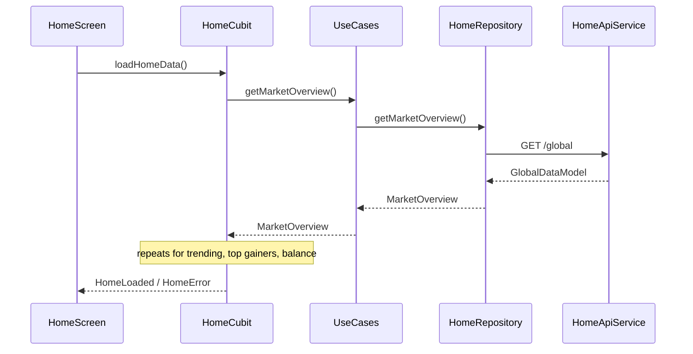

# Architecture

Clean Architecture with a modular feature layout, GetIt-powered dependency injection, and Cubit-driven presentation. The Core layer centralizes cross-cutting concerns: security, routing, networking, configuration, and error handling.

```mermaid
flowchart LR
  UI[Presentation\n(screens, widgets, cubits)] --> Domain[Domain\n(entities, use cases, repos contracts)]
  Data[Data\n(models, datasources, repo impls)] --> Domain
  Core[Core\n(di, security, networking, routing)] --> UI
  Core --> Data
  Core --> Domain
```

## Layer Breakdown

**Core (`lib/core/`)**
- DI container: `core/di/di.dart` wires everything; supports `AppEnvironment.test` with injectable security fakes.
- Security services: encryption, secure storage, biometrics, session manager, app lock, screenshot prevention, blur, audit logging, root detection.
- Routing: `core/routing/app_router.dart` + `RouteGenerator.mainRoutingInOurApp` guarded by session validity; `app_route_observer.dart` applies blur + screenshot blocking on sensitive routes.
- Networking: `core/networking/dio_client.dart` configures Dio; Retrofit services live in feature data layers.
- Config: timing, routes, security/storage keys (`core/config/*`).

**Data (per feature `features/*/data/`)**
- Models & Retrofit DTOs (e.g., `features/home/data/models/*`, `home_api_service.dart`).
- Remote/local data sources (Firebase auth/Firestore/storage in `features/auth/data/datasources`, encrypted local storage for transactions).
- Repository implementations (e.g., `HomeRepositoryImpl`, `PortfolioRepositoryImpl`, `AuthRepositoryImpl`, `TransactionRepositoryImpl`) encapsulate mapping, caching, debouncing, and error translation via `ApiErrorHandler`.

**Domain (per feature `features/*/domain/`)**
- Entities: business objects free of framework concerns (`MarketOverview`, `PortfolioHolding`, `AuthSessionEntity`).
- Use cases: single-responsibility interactors (e.g., `GetMarketOverviewUseCase`, `GetPortfolioOverviewUseCase`, `LoginUserUseCase`).
- Repository contracts define what the domain needs without implementation details.

**Presentation (per feature `features/*/presentation/`)**
- Cubits + states: `HomeCubit`, `PortfolioCubit`, `AuthCubit`, `BiometricVerifyCubit`, etc.
- Screens/widgets: composed UI bound to Cubit streams via `BlocBuilder`/`BlocListener`.
- Navigation hooks: screens rely on `GoRouter` routes defined centrally; sensitive screens opt into blur/screenshot prevention through the route observer.

## Dependency Injection (GetIt)
Key registration sequence in `core/di/di.dart`:
- Core: Dio client.
- Security: secure storage → encryption → biometrics → session manager → app lock → audit log → screenshot prevention → root detection → blur.
- Features: data sources → repositories → use cases → cubits (`registerFactory` for short-lived UI classes).
- Test mode: `SecurityOverrides` injects in-memory fakes (`test/support/test_security_fakes.dart`), keeping platform channels out of unit tests.

```mermaid
flowchart TD
  subgraph Security
    A[ISecureStorage]-->B[IEncryptionService]
    B-->C[ISessionManager]
    A-->D[IAppLockService]
    A-->E[IScreenshotPreventionService]
    A-->F[IBlurService]
  end
  subgraph Home Feature
    H[HomeApiService]-->I[HomeRepositoryImpl]
    I-->J[GetMarketOverviewUseCase]
    J-->K[HomeCubit]
  end
  CoreDI[GetIt Container]-->Security
  CoreDI-->Home Feature
```

## Request/State Flow (Home)
1. `HomeScreen` builds with `BlocProvider(create: (_) => sl<HomeCubit>()..loadHomeData())`.
2. `HomeCubit` sequentially runs `GetMarketOverviewUseCase`, `GetTrendingCoinsUseCase`, `GetTopGainersUseCase`, `GetPortfolioBalanceUseCase`, emitting `HomeLoading` then `HomeLoaded` or `HomeError`.
3. Use cases delegate to `HomeRepository` (interface) implemented by `HomeRepositoryImpl` with caching + debouncing.
4. Retrofit service (`HomeApiService`) calls CoinGecko endpoints; DTOs map to entities; failures translated to `ServerFailure`.
5. UI reacts via `BlocBuilder`, rendering loading/error/data widgets.



## Cross-Cutting Security Architecture
- Lifecycle gate: `main.dart` performs root detection, wires `SecureApplicationController`, listens to session/app-lock streams, and routes to `/app-lock` or `/login` when needed.
- Route observer: toggles blur + screenshot blocking for `RoutesConfig.sensitiveRoutes`.
- Secure persistence: `SessionManagerImpl` + `EncryptionServiceImpl` + `FlutterSecureStorageImpl` hold session tokens, biometric credentials, and transaction history encrypted at rest.
- Auto-lock: `AppLockServiceImpl` tracks inactivity (`TimingConfig.autoLockTimeout`) and emits lock events that redirect via `GoRouter`.

## Why This Architecture
- **Auditability & safety**: Security concerns live in Core and are injected everywhere, keeping feature modules lean.
- **Testability**: Domain is pure Dart; DI enables swapping security fakes and mock repositories.
- **Scalability**: Feature folders isolate business areas; adding a feature means adding a new module with its own data/domain/presentation without touching others.
- **Resilience**: Repositories cache (`HomeRepositoryImpl` global data cache, `PortfolioRepositoryImpl` fallback to cache), debounce requests, and normalize errors.

## Conventions
- Errors: `Either<Failure, T>` with typed failures (auth, biometric, session, server).
- Mapping: dedicated mappers (e.g., `MarketChartMapper`, `SettingsMapper`) keep DTO ↔ entity conversions out of UI/business logic.
- Timing: `TimingConfig` defines delays/timeouts for biometrics, navigation, sessions, and auto-lock; security defaults are “secure-by-default”.
- Routing: all protected routes are defined once in `RoutesConfig.authenticatedRoutes`; `RouteGenerator.redirect` enforces session validity.
