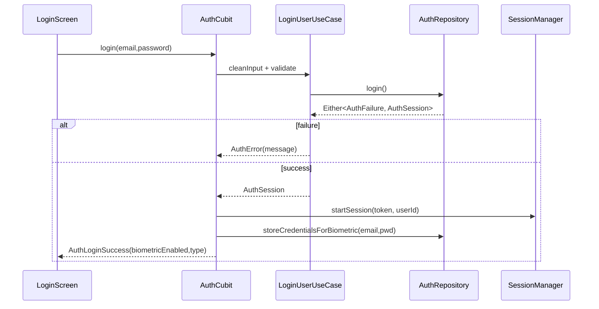
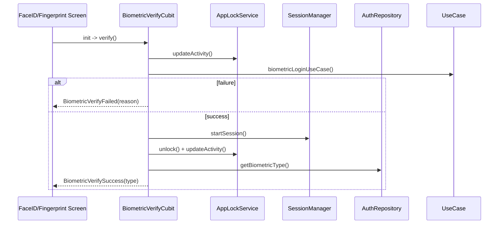

# Authentication & Session Flows

End-to-end description of login, registration, biometric verification, logout, and session lifecycle. The module uses Clean Architecture, Firebase for identity, and secure local storage for biometric/credential caching.

## Stack & Structure
```
lib/features/auth/
├─ domain/   # entities, use cases, repository contracts, validation
├─ data/     # Firebase datasources, secure local storage, mappers
└─ presentation/
   ├─ cubits/auth_cubit
   ├─ cubits/biometric_setup_cubit
   ├─ cubits/biometric_verify_cubit
   └─ screens/login | register | security_screens
```

Core dependencies:
- `AuthRepositoryImpl` (Firebase Auth/Firestore/Storage + secure storage for caching)
- `SessionManagerImpl` (encrypted session storage, timeouts)
- `AppLockServiceImpl` (inactivity lock)
- `BiometricService` (`local_auth`) + secure storage for credential reuse
- `SecureApplication` + route observer for blur/screenshot protection on sensitive auth screens

## Data Normalization & Cleaning
- `cleanInput` (`core/validation/input_cleaner.dart`) strips invisible markers and trims input before use cases run.
- `LoginUserUseCase` and `RegisterUserUseCase` validate email/password via `EmailValidator`/`PasswordValidator`.
- Biometric login trims stored credentials and validates format before calling the repository; invalid cached data triggers an explicit failure prompting manual login.

## Flows

### Email/Password Login

- Navigation: On success, GoRouter redirects away from `/login` via `RouteGenerator.redirect` because session becomes valid.
- Storage: `AuthLocalDataSource` caches user/session; `StorageKeysConfig` centralizes keys.

### Registration
```mermaid
flowchart TD
  A[Register form submit] --> B[RegisterUserUseCase\n(validates & cleans)]
  B -->|AuthFailure| E[AuthError]
  B -->|Session| C[AuthRegisterSuccess(userId)]
  C --> D[Optionally start biometric setup]
  C --> S[SessionManager.startSession]
```
- `AuthRepositoryImpl.register` writes Firebase user, caches session, and persists `UserSettings` (biometric enabled flag).
- Biometric prompt can be triggered post-registration (`BiometricSetupCubit`) to store preferred type.

### Biometric Login
- Triggered from Face ID / Fingerprint verify screens.
- `BiometricVerifyCubit.verify` guards duplicate prompts, updates activity to avoid auto-lock during native dialog, runs `BiometricLoginUseCase`.
- Success path: stores credentials, starts session, unlocks app, and emits `BiometricVerifySuccess(biometricType)`.
- Failure path: `BiometricVerifyFailed` with reason; UI falls back to password login.

### Logout
- `AuthRepository.signOut` signs out of Firebase and clears cached user data.
- `SessionManager.endSession` wipes encrypted session payload and timestamps.
- `AppLockService.resetLock` ensures lock state is cleared.
- `GoRouter` redirect sends user to `/login` on next navigation due to invalid session.

### Session & Token Lifecycle
- **Start**: On login/registration/biometric success, `SessionManager.startSession` stores an encrypted session (userId, token, expiresAt) and marks `session_active=true`.
- **Heartbeat**: `SessionManager` polls validity (`TimingConfig.sessionPollInterval`) and emits on `sessionStateStream`; main app listens and redirects to `/login` when invalid.
- **Activity tracking**: Pointer events call `updateActivity` (see `FintechApp` in `main.dart`); `AppLockService` and `SessionManager` use `StorageKeysConfig.lastActivityTime`.
- **Expiration**: If expired, `SessionManager` emits false, clears data, and `AppRouteObserver`/GoRouter redirect to `/login`.

## Error Handling
- Failures are typed: `AuthFailure`, `BiometricFailure`, `SessionFailure`, and mapped to friendly messages in `AuthCubit._mapFailureToMessage`.
- Validation failures (email/password) are returned before hitting Firebase.
- Biometric failures include availability/enrollment checks; cached credential format errors point users to password login to refresh cache.

## Secure Storage & Encryption
- `EncryptionServiceImpl` (AES-256-GCM) + `FlutterSecureStorageImpl` secure:
  - Session payloads (`StorageKeysConfig.sessionId`, `sessionActive`, `lastActivityTime`).
  - Biometric credentials (`biometric_email`, `biometric_password`, `biometric_type`).
  - Auth tokens and refresh tokens.
- `SessionManagerImpl` encrypts session JSON via `SessionMapper`.
- `BiometricLoginUseCase` decrypts stored credentials before use.

## Navigation & Guards
- Routes: see `core/routing/app_router.dart`. Protected routes list lives in `RoutesConfig.authenticatedRoutes`.
- Guard: `RouteGenerator.redirect` checks `ISessionManager.isSessionValid()` before allowing access to protected paths.
- Sensitive screens: `RoutesConfig.sensitiveRoutes` trigger blur + screenshot blocking through `AppRouteObserver`.

## Sequence: Biometric Verify Screen


## Extending the Auth Module
- Add MFA/SMS/email verification by creating new use cases and repository methods; keep Firebase-specific code in data sources.
- Add password reset by adding a `ForgotPasswordUseCase` and screens; wire to `AuthRepository`.
- Refresh tokens: extend `AuthSessionEntity` and `SessionManager` to store/refresh, keeping encryption in place.

## References
- Cubits: `lib/features/auth/presentation/cubits/**`
- Use cases: `lib/features/auth/domain/usecases/**`
- Repository + datasources: `lib/features/auth/data/**`
- Security services: `lib/core/security/implementations/**`, `lib/core/config/storage_keys_config.dart`
