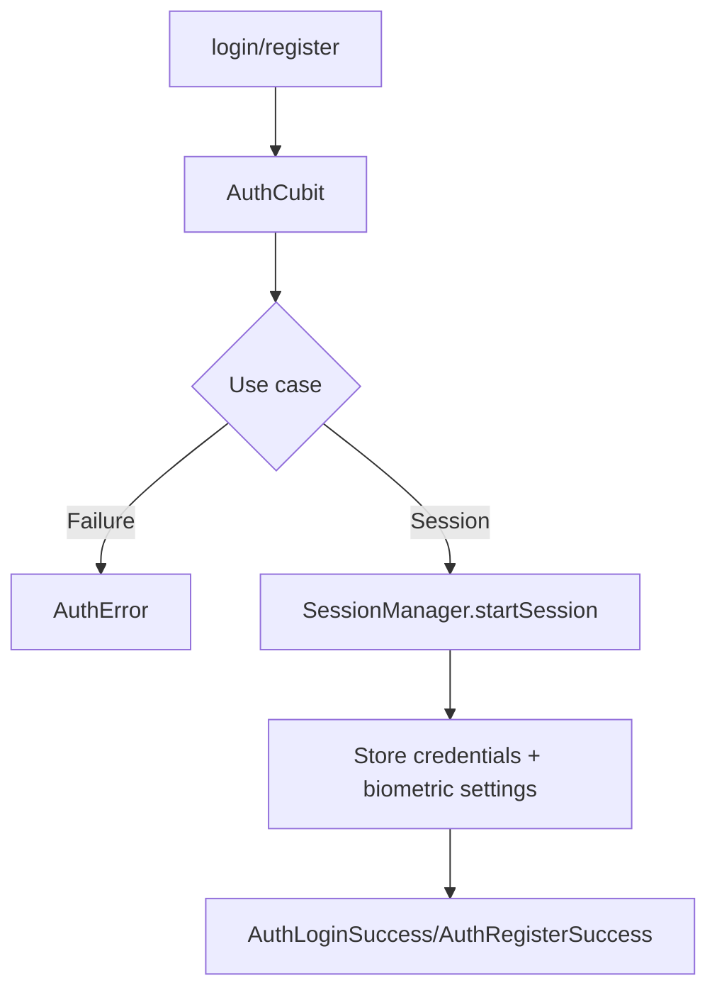

# Auth Module

## Purpose
Authenticate users (email/password + biometrics), manage sessions, and persist credentials securely. Backed by Firebase Auth/Firestore/Storage with secure local storage for biometric reuse.

## Structure
```
features/auth/
├─ domain/
│  ├─ entities/ (AuthSessionEntity, RegisterUserEntity, BiometricCredentialsEntity)
│  ├─ repositories/auth_repository.dart
│  └─ usecases/login_user_usecase.dart, register_user_usecase.dart,
│     biometric_login_usecase.dart, store_biometric_settings_usecase.dart
├─ data/
│  ├─ datasources/auth_remote_datasource.dart (Firebase), auth_local_datasource_impl.dart (secure storage)
│  ├─ repositories/auth_repository_impl.dart
│  ├─ models (user, session, settings)
│  └─ mappers (session_mapper.dart, settings_mapper.dart)
└─ presentation/
   ├─ cubits/auth_cubit, biometric_setup_cubit, biometric_verify_cubit
   ├─ screens/login, register, security_screens (app-lock, root warning)
   └─ debug screens (biometric test/debug)
```

## Dependencies
- Firebase Auth/Firestore/Storage
- `ISessionManager`, `IAppLockService`, `IBiometricService`, `IEncryptionService`, `ISecureStorage`
- GoRouter (`RouteGenerator.redirect`) for protected navigation

## Cubits & State
- `AuthCubit`: handles login/register/biometric login.
- `BiometricVerifyCubit`: guards duplicate prompts; updates activity before native dialog; unlocks on success.
- `BiometricSetupCubit`: persists biometric preferences during registration.



## API Calls
- Firebase email/password:
  - `AuthRemoteDataSource.signInWithEmailAndPassword(email, password)`
  - `AuthRemoteDataSource.registerWithEmailAndPassword(...)`
- No REST auth endpoints yet; add via `AuthRepositoryImpl` if needed.

## Models & Mapping
- `UserModel`/`UserSettings` ↔ `UserEntity`/`UserSettingsEntity` via mappers.
- `SessionMapper` encrypts/decrypts session JSON for `SessionManagerImpl`.

## Notes
- Input cleaning: `cleanInput` removes invisible markers and trims before use cases.
- Biometric cache lives in secure storage under `biometric_*` keys; invalid cache triggers explicit failure to force password login.
- App-lock reset is performed after successful auth to avoid instant relock.
