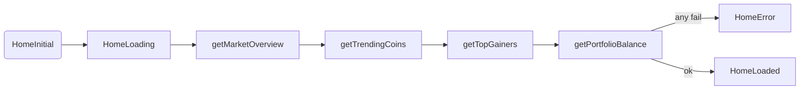

# Home Module

## Purpose
Display the dashboard (market overview, trending coins, top gainers, portfolio snapshot) backed by CoinGecko data with client-side caching and debouncing.

## Structure
```
features/home/
├─ data/
│  ├─ data_sources/home_api_service.dart (Retrofit)
│  ├─ models/ (GlobalDataModel, TrendingCoinModel, TopGainerModel)
│  └─ repositories/home_repository_impl.dart
├─ domain/
│  ├─ entities/ (MarketOverview, TrendingCoinEntity, TopGainerEntity, PortfolioBalance)
│  ├─ repositories/home_repository.dart
│  └─ usecases/get_market_overview_usecase.dart, get_trending_coins_usecase.dart,
│        get_top_gainers_usecase.dart, get_portfolio_balance_usecase.dart
└─ presentation/
   ├─ cubit/home_cubit.dart + home_state.dart
   └─ screens/widgets for dashboard (balance card, trending list, gainers list, etc.)
```

## Dependencies
- Dio + Retrofit (`HomeApiService`)
- `AppConstants.marketDataCacheDuration` for caching
- CoinGecko endpoints (`core/networking/endpoints.dart`)

## Cubit Flow

- Debounce between requests (~300ms) to avoid API throttling.
- Caches `/global` response for `marketOverview` and portfolio balance derivation.

## API Calls
- `GET /global` → `GlobalDataModel` → `MarketOverview`
- `GET /search/trending` → `TrendingCoinsModel` → `TrendingCoinEntity`
- `GET /coins/markets` (top gainers params) → `TopGainerModel` → `TopGainerEntity`

## Models & Mapping
- Currency/percent formatting done in repository (`_formatCurrency`) and entities carry already formatted strings to the UI.
- Portfolio balance is derived from cached global data using multipliers in `AppConstants`.
