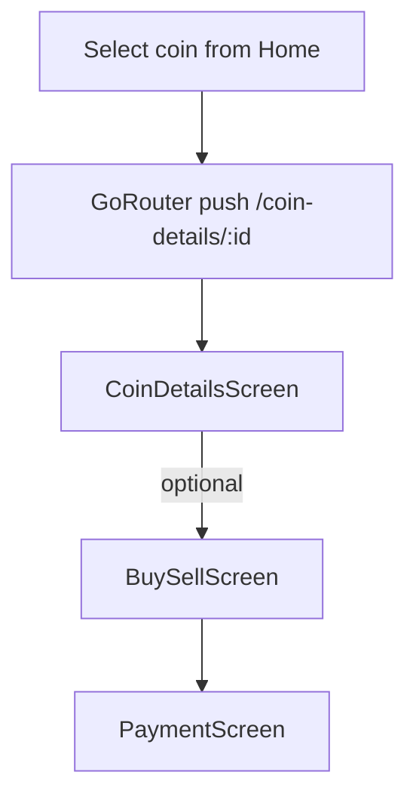

# Market Module

## Purpose
Present coin details, price chart, and buy/sell simulation UI. Uses existing market data (from home module) and static/demo data for trade flows; no dedicated domain/data layer yet.

## Structure
```
features/market/presentation/
├─ screens/ (market_screen, coin_details_screen, buy_sell_screen, payment_screen)
└─ widget/ (price chart, stats list, payment method UI, conversion cards, etc.)
```

## Dependencies
- GoRouter navigation (`/market`, `/coin-details/:id`, `/buy-sell/:id`, `/payment`).
- Shared UI/constants from `core/common_ui` and app theme.
- Receives coin IDs from lists (e.g., trending/top gainers) for detail navigation.

## State
- No Cubit currently; widgets receive data via navigation arguments or compose static/demo data.
- If trade logic is added, introduce `MarketRepository`, `GetQuoteUseCase`, and a `MarketCubit` to keep alignment with other features.

## Example Data Flow (planned)


## Models & Mapping
- Presentational view models live inside widgets (e.g., credit card data classes). When adding APIs, create DTOs + entities and map them before reaching the UI.
