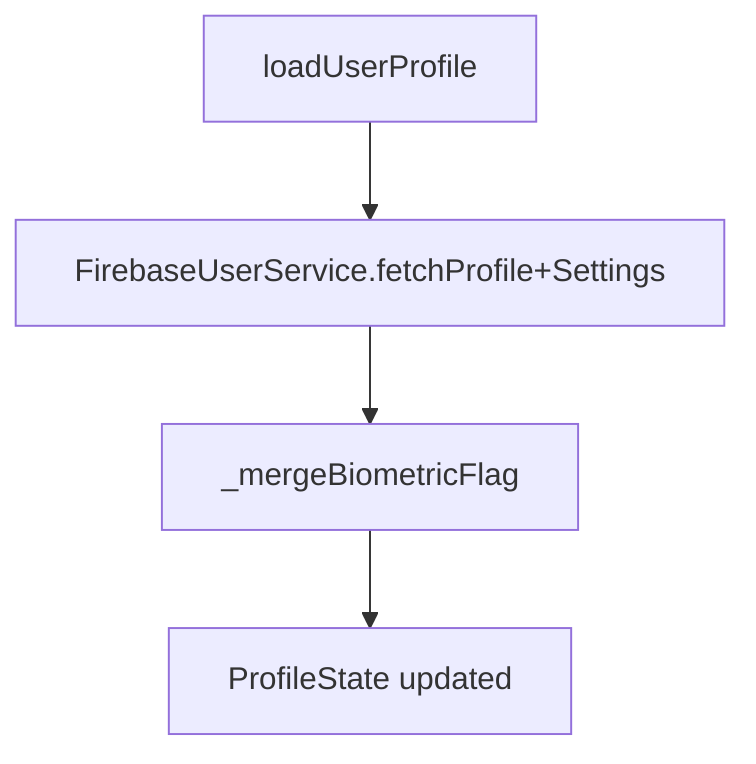

# Profile Module

## Purpose
Display and manage user profile, avatar, and security-related settings (biometric toggle, session/auto-lock preferences). Syncs with Firebase Storage/Firestore and local biometric flag.

## Structure
```
features/profile/
├─ presentation/
│  ├─ cubit/profile_cubit.dart + profile_state.dart
│  ├─ screens/my_account_screen.dart
│  └─ widgets/ (avatar_section, security_section, profile_form)
```

## Dependencies
- `FirebaseUserService` (auth data source) for profile/settings CRUD + avatar upload.
- `AuthLocalDataSource` (via service) to merge local biometric-enabled flag.
- GoRouter for navigation (`/my-account`).

## Cubit Flow
- `loadUserProfile()` fetches profile + settings, merges local biometric flag, emits loaded state.
- `startWatching()` subscribes to Firestore streams for live updates.
- `saveProfileUpdates`/`updateAvatar`/`updateBiometricSetting`/`updateAutoLock` persist changes then update state.



## Models & Mapping
- `UserProfile` and `UserSettings` data models (data layer) map directly to UI state; biometric flag may be overridden by local secure setting for privacy.
