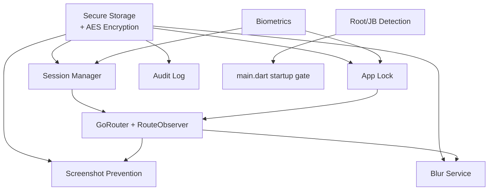
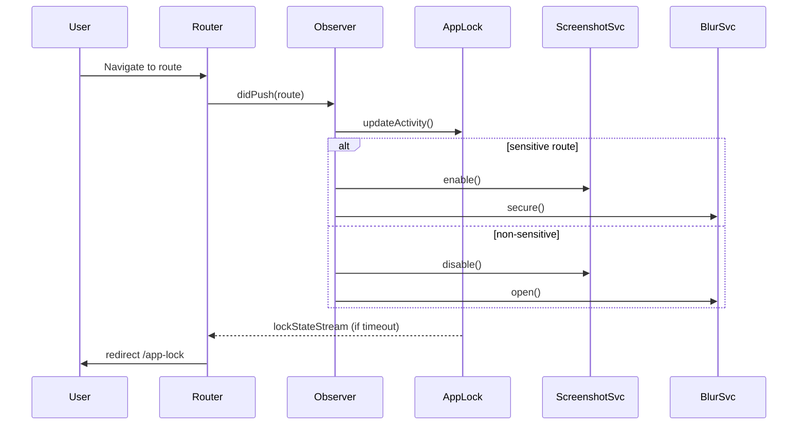

# Security Features – Complete Reference

This file must always exist. It documents the defense-in-depth controls in the app and how they interact.

## Stack Overview

Principles: secure-by-default, explicit opt-outs, least privilege, encrypted-at-rest, and observable (audit).

## Feature Deep Dive

### Biometric Authentication
- **Files**: `core/security/interfaces/i_biometric_service.dart`, `core/security/implementations/local_auth_biometric_impl.dart`
- **Flows**: Used by `BiometricVerifyCubit` and `BiometricSetupCubit`; guarded to avoid duplicate prompts; enrollment and availability checked before prompting.
- **Config**: `core/config/biometric_config.dart` (`defaultAuthReason`, `useSensitiveAuth`).
- **Data**: Encrypted email/password + type persisted via `AuthLocalDataSource` (`biometric_email`, `biometric_password`, `biometric_type`).

### Encrypted Secure Storage
- **Files**: `FlutterSecureStorageImpl`, `EncryptionServiceImpl`, `StorageKeysConfig`.
- **Algorithm**: AES-256-GCM via `encrypt`; keys stored in platform keystore/keychain.
- **Protected payloads**: sessions (`session_id`, `session_active`, `last_activity_time`), biometric credentials, audit logs, transaction history, user metadata.

### Session Management
- **Files**: `SessionManagerImpl`, `AuthSessionEntity`, `SessionMapper`.
- **Behavior**: Encrypts session JSON, starts timers, polls validity (`TimingConfig.sessionPollInterval`), and emits `sessionStateStream`.
- **Lifecycle**: Start on auth success; update activity on pointer events; expire after `TimingConfig.sessionTimeout` unless extended.
- **Routing**: `RouteGenerator.redirect` checks `isSessionValid()` for protected routes.

### App Lock / Auto-Lock
- **Files**: `AppLockServiceImpl`, `IAppLockService`, `TimingConfig.autoLockTimeout`.
- **Behavior**: Tracks `last_activity_time`; timer triggers `lock()` after inactivity (default 120s). Exposes `lockStateStream`; `main.dart` navigates to `/app-lock` on lock events.
- **Reset**: `resetLock()` invoked after successful login/biometric to avoid immediate re-lock.

### Screenshot Prevention
- **Files**: `ScreenshotPreventionServiceImpl`, `IScreenshotPreventionService`, `RoutesConfig.sensitiveRoutes`.
- **Behavior**: Route observer toggles platform secure mode (FLAG_SECURE/UIScreenCaptured). Protected routes persisted (`protected_routes`).
- **Notes**: iOS disables secure mode on exit; Android leaves secure flag on sensitive screens only.

### Background Blur
- **Files**: `BlurServiceImpl`, `IBlurService`, `AppRouteObserver`.
- **Behavior**: Uses `secure_application` controller to blur sensitive views when app goes background or when route marked sensitive; non-blur routes (auth, onboarding) are whitelisted.
- **State**: `blurStateStream` broadcasts current visibility; persisted preference under `blur_enabled`.

### Jailbreak/Root Detection
- **Files**: `RootDetectionServiceImpl`, `IRootDetectionService`.
- **Startup**: `_performSecurityChecks()` in `main.dart` runs on prod launch; failures send users to `/root-warning` after `TimingConfig.splashRootWarningDelay`.
- **Consent**: Users can accept risk (`accepted_root_risk` in secure storage) to avoid repeated warnings; audit log records detections.

### Audit Logging
- **Files**: `AuditLogServiceImpl`, `IAuditLogService`, `config/audit_log_config.dart`.
- **Behavior**: Stores security events (root detection, lock/unlock) encrypted; enforces max entries and cleanup cadence.
- **Usage**: Called in `main.dart` for root detection and can be reused across features for security-sensitive events.

## Interaction Model
- **Route Observer** (`core/observers/app_route_observer.dart`):
  - On push/pop/replace: updates activity (`AppLockService`), applies blur, and enables screenshot prevention for `RoutesConfig.sensitiveRoutes`.
  - Non-blur routes (auth/onboarding/lock/debug) keep screens clear for usability.
- **Main App Lifecycle** (`main.dart`):
  - Subscribes to `lockStateStream` → redirect to `/app-lock`.
  - Subscribes to `sessionStateStream` → redirect to `/login`.
  - Pointer listener calls `updateActivity()` on both services.
- **Security Overrides for Tests**: `SecurityOverrides` + `test/support/test_security_fakes.dart` replace platform-sensitive services with in-memory no-ops.

## Configuration
- Timing: `core/config/timing_config.dart` (`sessionTimeout`, `autoLockTimeout`, poll intervals).
- Security: `core/config/security_config.dart` (enable/disable detectors, default timeouts, sensitive routes).
- Routes: `core/config/routes_config.dart` (sensitive + authenticated route lists).
- Storage Keys: `core/config/storage_keys_config.dart`.

## Testing Guidance
- Unit tests cover encryption, session manager, app lock, screenshot prevention, biometrics, and root detection (`test/core/security/*`).
- Platform-bound tests can be skipped or replaced with fakes; use `setupDependencies(env: AppEnvironment.test, securityOverrides: createTestSecurityOverrides())`.
- Validate app lock/session flows by asserting emitted stream values and persisted timestamps.

## Troubleshooting
- **Immediate lock after login**: Ensure `resetLock()`/`unlock()` are called on success and pointer events trigger `updateActivity()`.
- **Biometric prompt missing**: Confirm enrollment via `IBiometricService.isEnrolled()` and that lock is not active.
- **Screenshot blocking absent**: Verify route is in `RoutesConfig.sensitiveRoutes` and channel `screenshot_prevention` is available.
- **Root warning loop**: Delete `accepted_root_risk` to re-test; ensure `_performSecurityChecks()` runs only once on startup.
