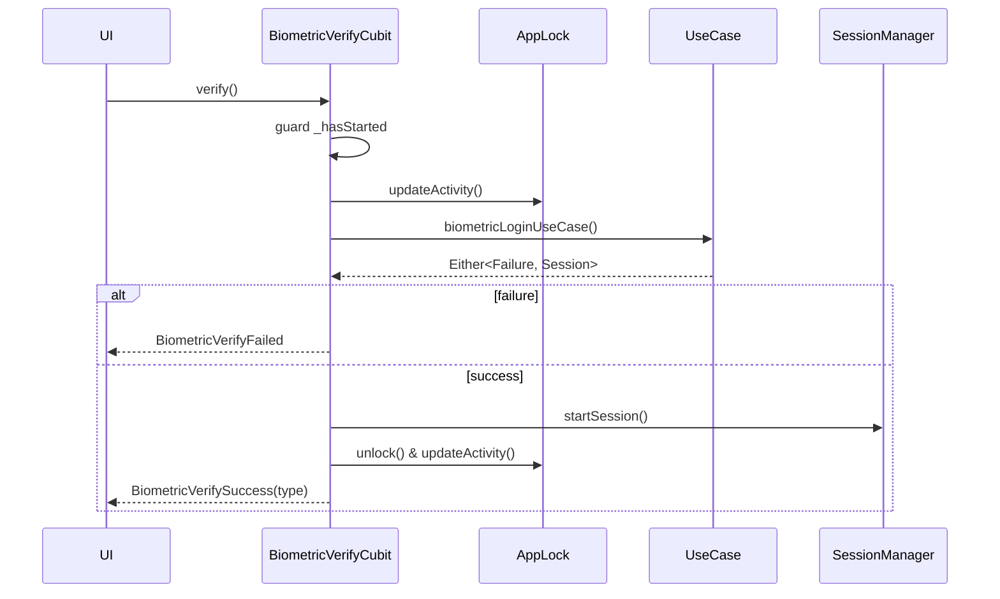

# State Management (Cubit)

The app uses `flutter_bloc` with **Cubit** for predictable, lightweight state transitions. DI (`GetIt`) constructs Cubits with use cases and services; UI listens via `BlocBuilder`/`BlocListener`.

## Principles
- **Single-responsibility Cubits** per feature, emitting immutable state classes.
- **Pure inputs/outputs**: Cubits depend on domain use cases, never directly on data sources.
- **Typed failures**: Use cases return `Either<Failure, T>`; Cubits map failures to user-facing strings.
- **Lifecycle-aware**: Guards for `isClosed` and duplicate invocations (e.g., biometric verification).

## Core Cubits & Flows

### AuthCubit (`features/auth/presentation/cubits/auth_cubit`)
- Handles email/password login, registration, and biometric login.
- Wires into session + secure storage: starts session, stores credentials, and persists biometric settings.

```mermaid
flowchart TD
  A[login(email,password)] -->|AuthLoading| B{LoginUserUseCase}
  B -->|Failure| C[AuthError(message)]
  B -->|Session| D[storeCredentials + startSession]
  D --> E[persist biometric creds]
  E --> F[AuthLoginSuccess(biometricEnabled,type)]
```

### BiometricVerifyCubit (`features/auth/presentation/cubits/biometric_verify_cubit`)
- Prevents duplicate prompts (`_hasStarted` guard).
- Updates activity before native prompt to avoid auto-lock; unlocks and restarts session on success.



### HomeCubit (`features/home/presentation/cubit/home_cubit.dart`)
- Sequentially executes four use cases with short delays to avoid overloading the API.
- Emits `HomeLoading` → `HomeLoaded` or `HomeError`.

```mermaid
flowchart LR
  Start(HomeInitial) --> L[HomeLoading]
  L --> M[getMarketOverview]
  M --> T[getTrendingCoins]
  T --> G[getTopGainers]
  G --> P[getPortfolioBalance]
  P -->|any failure| E[HomeError]
  P -->|all success| D[HomeLoaded(market, trending, gainers, balance)]
```

### PortfolioCubit (`features/portfolio/presentation/cubit/portfolio_cubit.dart`)
- Loads portfolio overview (optionally per month), formats currency/percentages, builds allocation segments for charts.
- States: `PortfolioState.loading()`, `PortfolioState.loaded(...)`, `PortfolioState.error(...)`.

### Profile / Settings
- `ProfileCubit` surfaces cached profile info and security tiles; settings screen is mostly presentational with navigation to security controls (auto-lock, biometrics) via shared services.

### App Lifecycle Listeners
- `main.dart` attaches:
  - `SecureApplicationController` for blur/screenshot control (`app_route_observer`).
  - Listeners to `IAppLockService.lockStateStream` and `ISessionManager.sessionStateStream` to redirect to `/app-lock` or `/login`.
  - `AppLockService.updateActivity()` + `SessionManager.updateActivity()` on pointer down to keep timers fresh.

## UI Wiring Patterns
- Provide Cubits with DI:
  ```dart
  BlocProvider(
    create: (_) => sl<HomeCubit>()..loadHomeData(),
    child: HomeScreen(),
  );
  ```
- Listen/Build:
  ```dart
  BlocConsumer<AuthCubit, AuthState>(
    listener: (_, state) { /* route on success */ },
    builder: (_, state) => state is AuthLoading
        ? const Loading()
        : LoginForm(error: (state is AuthError) ? state.message : null),
  );
  ```

## Error & Loading Handling
- Loading: explicit `*Loading` states (Auth, Home) or `isLoading` flag (PortfolioState).
- Errors: failures mapped to localized strings (`_mapFailureToMessage` in `AuthCubit`); UI shows inline errors or error screens.
- Security-sensitive flows keep timers updated during blocking operations (biometric prompts) to avoid unintended locks.

## State Testing Guidance
- Unit-test Cubits with mock use cases/security services; assert emitted state sequences (`blocTest`).
- For security-dependent Cubits, inject fakes from `test/support/test_security_fakes.dart`.
- Keep Cubit constructors side-effect free (no IO) so tests stay deterministic; invoke explicit `load()`/`verify()` methods instead.
